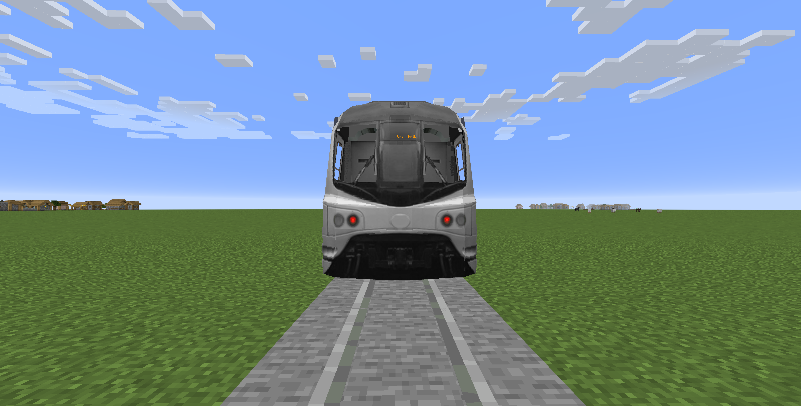
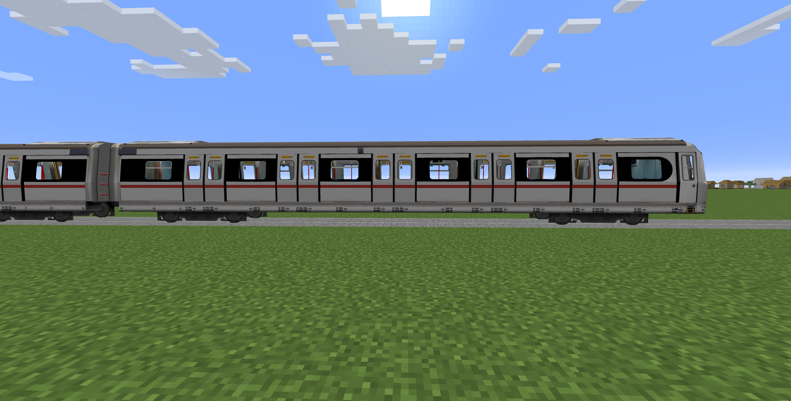
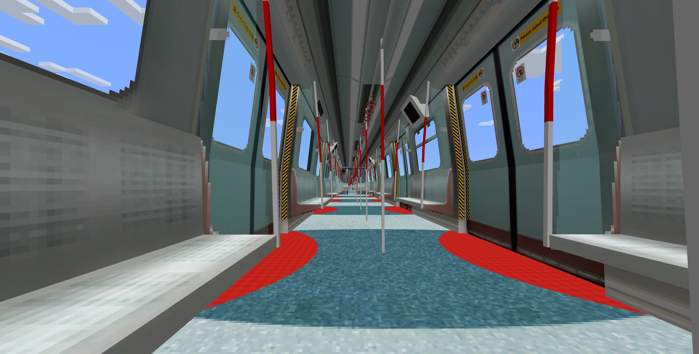

# MLR Red Waistline Train

This is a resource pack designed for the [Minecraft-Transit-Railway](https://github.com/Minecraft-Transit-Railway/Minecraft-Transit-Railway) MOD for Minecraft, adding a red waistline livery to the MLR train.

## Train Models

- **Red waistline livery: Red waistline** (`#dc241f`​) **, black windows**
- **Interior: No changes**
- **Multiple model support - Full MLR series specifications:**

  1. Standard size: 5 doors, 6 windows

  2. Small size: 4 doors, 5 windows

  3. Mini size: 2 doors, 3 windows

## Appearance

### Train Appearance Showcase

**Front view (unchanged)**


**Side view**


**Interior view (unchanged)**


## File Structure

```
resource_pack/
├── pack.mcmeta          # Resource pack metadata
├── pack.png            # Resource pack icon
└── assets/
    └── mtr/
        ├── mtr_custom_resources.json  # Custom train configuration
        └── custom_directory/
            ├── mlr_red.png           # Red waistline train texture
            └── custom_sign.png       # Custom sign texture
```

## How to Install

1. Download this resource pack
2. Package the contents of the `resource_pack`​ folder into a ZIP file and copy it to Minecraft's `resourcepacks` directory:

   ```
   ├── pack.mcmeta          # Resource pack metadata
   ├── pack.png            # Resource pack icon
   └── assets/
       └── mtr/
           ├── mtr_custom_resources.json  # Custom train configuration
           └── custom_directory/
               ├── mlr_red.png           # Red waistline train texture
               └── custom_sign.png       # Custom sign texture
   ```
3. Enable this resource pack in the game
4. Ensure the MTR mod is installed

## Compatibility

- **Minecraft version**: Supports 1.16 version
- **MTR mod version**: Supports 3.2.2, but also supports later versions (e.g., 4.0.2)

### How to Resolve Version Incompatibility

Navigate to pack.mcmeta in the resource pack folder, you will see the following content:

```mcmeta
{
	"pack": {
		"pack_format": 6,
		"description": "MLR train with red waistline"
	}
}
```

Change the value of `"pack_format"`​ to your version number according to the [Minecraft official wiki](https://minecraft.wiki/w/Resource_pack#pack.mcmeta):

|Version|Number|
| ------------------| -------|
|1.6.1 - 1.8.9|1|
|1.9 - 1.10.2|2|
|1.11 - 1.12.2|3|
|1.13 - 1.14.4|4|
|1.15 - 1.16.1|5|
|1.16.2 - 1.16.5|6|
|1.17 - 1.17.1|7|
|1.18 - 1.18.2|8|
|1.19 - 1.19.2|9|
|1.19.3|11-12|
|1.19.4|13|
|1.20 - 1.20.1|15|
|1.20.2|16-18|
|1.20.3 - 1.20.4|22|
|1.20.5 - 1.20.6|32|
|1.21 - 1.21.4|47|
|1.21.5|55|
|1.21.6 - 1.21.8|64|
|1.21.9 - 1.21.10|69.0|
|1.21.11|75.0|

## License

This project is licensed under the MIT License. See the [LICENSE](LICENSE) file for details.